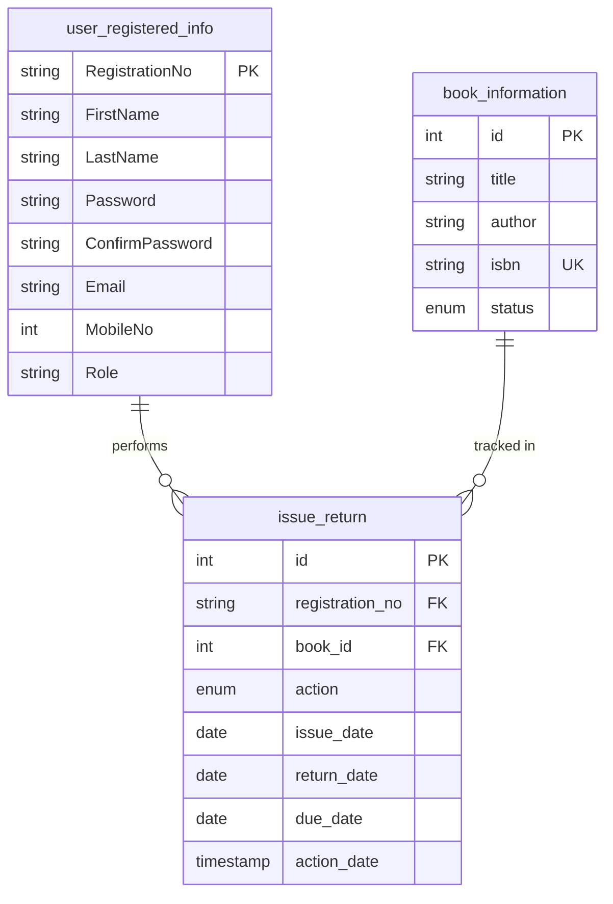

# 📚 ITUM Library Management System

<div align="center">


[](https://www.php.net/)
[](https://www.mysql.com/)
[](https://getbootstrap.com/)
[](https://developer.mozilla.org/en-US/docs/Web/Guide/HTML/HTML5)
[](https://developer.mozilla.org/en-US/docs/Web/CSS)
[](https://developer.mozilla.org/en-US/docs/Web/JavaScript)
[](LICENSE)

<p align="center">
  <b>A comprehensive, secure, and user-friendly web-based Library Management System developed for the Institute of Technology, University of Moratuwa (ITUM).</b>
</p>

[Explore Features](#-key-features) • [Installation Guide](#-installation--setup) • [Database Architecture](#-database-architecture) • [Project Structure](#-project-structure) • [Roadmap](#-future-roadmap)

</div>

---

## 📖 Overview

The **ITUM Library Management System (LMS)** is an end-to-end web application built to streamline library operations, automate catalog tracking, and provide a seamless borrowing and returning experience for both students and library administrators.

Designed with modern web practices, the system features robust role-based access control, real-time inventory management, automated 14-day borrowing cycle calculations, and an intuitive UI with glassmorphism styling and responsive navigation.

---

## ✨ Key Features

### 🔐 Authentication & Access Control
- **Role-Based Access Control (RBAC)**: Distinct permissions and views for **Admin** and **User (Student)** accounts.
- **Secure Authentication**: Passwords hashed using industry-standard `bcrypt` (`password_hash` / `password_verify`).
- **Session Management**: Protected routes ensuring unauthorized users cannot access internal dashboards or management portals.
- **User Registration**: Real-time validation for registration numbers, emails, and password confirmation.

### 📚 Book Catalog & Inventory Management
- **Full CRUD Support**: Add new books, view catalog, update book metadata, and delete obsolete records.
- **Interactive Modals**: Seamless editing and book addition without leaving the catalog view.
- **Inventory Status Tracking**: Real-time status flags (`available` vs. `issued`) preventing double-lending.
- **Unique ISBN Tracking**: Integrity enforcement with unique ISBN constraints.

### 🔄 Circulation & Lending Engine (Issue & Return)
- **Book Issuing**:
  - Admin view: Select student registration number and assign book IDs.
  - User view: Simplified self-issue interface locked to session identity.
  - Automatic **14-day due date calculation** with timezone handling (`Asia/Colombo`).
  - Automatic inventory status switching (`available` ➔ `issued`).
- **Book Returns**:
  - Instant lookup of active lending transactions.
  - Automatic update of book status back to `available`.
  - Transaction timestamping for audit trails.

### 👥 Member Directory & Admin Suite
- **Member Directory**: Tabular overview of all registered members, roles, email addresses, and contact numbers.
- **Reports & Fine Modules**: Modular architecture prepared for financial penalties and institutional analytics.

---

## 🛠️ Technology Stack

| Layer | Technologies |
|---|---|
| **Frontend** | HTML5, CSS3, JavaScript (ES6+), Bootstrap 5.3, Font Awesome 6.5 |
| **Backend** | PHP 8.x (Procedural & Object-Oriented with MySQLi Prepared Statements) |
| **Database** | MySQL / MariaDB (InnoDB/MyISAM, UTF8mb4) |
| **Server Environment** | Apache (XAMPP / WampServer / LAMP / Docker) |

---

## 🗄️ Database Architecture

The application uses a normalized MySQL relational database named `library_management_system`.



### Table Breakdown

1. **`user_registered_info`**: Stores registered student and administrative profiles, credential hashes, and assigned roles (`Admin` | `User`).
2. **`book_information`**: Maintains book metadata including Title, Author, ISBN (unique), and Availability Status (`available` | `issued`).
3. **`issue_return`**: Tracks historical and active lending transactions, action types (`issue` | `return`), issue dates, return dates, and due dates.

---

## 📂 Project Structure

```plaintext
ITUM_Library_Management_System_Software/
├── css/
│   └── style.css                     # Main stylesheet (Glassmorphism, custom UI & themes)
├── js/
│   └── main.js                       # Frontend UI interaction & modal controller
├── image/
│   ├── Background1.jpg               # Landing page background
│   ├── LMS 1 .png                    # Hero graphics & registration artwork
│   ├── LMS 2 .png                    # Authentication artwork
│   └── Logo.png                      # Application branding & emblem
├── php/
│   ├── connection.php                # Database connection helper (mysqli)
│   ├── dashboard.php                 # Main control hub for Admin & Students
│   ├── book_management.php           # Catalog CRUD operations & modal forms
│   ├── issue_books.php               # Book lending workflow & date computation
│   ├── return_books.php              # Book return processing & inventory release
│   ├── member.php                    # Registered members directory (Admin only)
│   ├── fine_management.php           # Overdue fine management module
│   ├── report.php                    # System summary & circulation reports
│   └── logout.php                    # Session termination & cleanup
├── index.html                        # Public landing page with navigation
├── login.php                         # Secure user & admin login interface
├── register.php                      # New member registration portal
├── library_management_system.sql     # Database schema & seed data
└── README.md                         # Project documentation
```

---

## 🚀 Installation & Setup

### 📋 Prerequisites
Ensure you have the following installed on your machine:
- **XAMPP** / **WampServer** / **MAMP** or any local PHP environment with:
  - **PHP >= 8.0**
  - **MySQL >= 5.7** or **MariaDB >= 10.4**
  - **Apache Web Server**
- A modern web browser (Chrome, Firefox, Edge, Safari)
- Git (optional, for cloning)

---

### ⚙️ Step-by-Step Installation

#### 1. Clone or Download the Repository
Clone this repository to your local web server root directory:

```bash
# For XAMPP (Windows):
cd C:\xampp\htdocs\
git clone https://github.com/umindudinal/ITUM_Library_Management_System_Software.git

# For WampServer:
cd C:\wamp64\www\
git clone https://github.com/umindudinal/ITUM_Library_Management_System_Software.git
```

#### 2. Start Web & Database Services
Open **XAMPP Control Panel** (or WampServer) and start:
- **Apache**
- **MySQL**

#### 3. Import Database
1. Open your browser and navigate to `http://localhost/phpmyadmin/`.
2. Click **New** in the left sidebar and create a database named:
   ```sql
   library_management_system
   ```
3. Select the `library_management_system` database and click the **Import** tab.
4. Click **Choose File**, select `library_management_system.sql` from the project root directory, and click **Import**.

#### 4. Configure Database Connection (Optional)
If your MySQL server credentials differ from standard defaults, verify or update `php/connection.php`:

```php
function getDatabaseConnection() {
    $servername = "localhost";
    $username   = "root";     // Your MySQL username
    $password   = "";         // Your MySQL password
    $dbname     = "library_management_system";

    $connection = new mysqli($servername, $username, $password, $dbname);
    if ($connection->connect_error) {
        die("Connection failed: " . $connection->connect_error);
    }
    return $connection;
}
```

#### 5. Launch the Application
Open your web browser and navigate to:
```text
http://localhost/ITUM_Library_Management_System_Software/
```

---

## 🔑 Demo & Test Credentials

The database comes pre-seeded with sample accounts for testing:

| Role | Registration No | Password | Description |
|---|---|---|---|
| **Admin** | `23IT0470` | *(Set during registration)* | Full system access (Books, Members, Reports, Fines) |
| **Student (User)** | `23IT0527` | *(Set during registration)* | Standard borrowing & returning privileges |
| **Student (User)** | `23IT0459` | *(Set during registration)* | Standard borrowing & returning privileges |

> 💡 **Tip**: You can also register a brand-new user or admin directly from the [Registration Page](register.php).

---

## 🔒 Security & Best Practices

- **SQL Injection Prevention**: Key queries utilize **Prepared Statements** (`bind_param`) to protect against injection vulnerabilities.
- **Password Security**: Passwords are saved as one-way cryptographic hashes using PHP's `password_hash()` and verified via `password_verify()`.
- **XSS Protection**: Dynamic output strings are sanitized using `htmlspecialchars()` before rendering to the DOM.
- **Session Isolation**: Protected endpoints verify authenticated session tokens before executing privileged actions.

---

## 🗺️ Future Roadmap

- [ ] **Automated Fine Calculation**: Dynamic calculation of late fees based on `due_date` vs `return_date`.
- [ ] **Search & Filtering**: Live search and pagination for book inventory and transaction logs.
- [ ] **Barcode / QR Code Support**: Fast scan-to-issue and scan-to-return via webcam or USB scanner.
- [ ] **PDF & Excel Export**: Exportable circulation, inventory, and member reports.
- [ ] **Email Notifications**: Automated reminder emails for approaching due dates and overdue books.

---

## 👥 Contributors

- **Umindu Dinal** ([@umindudinal](https://github.com/umindudinal)) — *Lead Developer & Maintainer*
- Institute of Technology, University of Moratuwa (ITUM)

---

## 📄 License

This project is licensed under the **MIT License** — feel free to use, modify, and distribute it for academic and commercial purposes.
